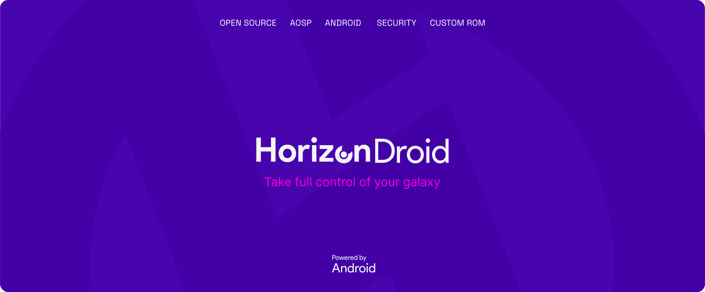
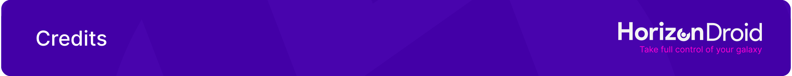

HorizonDroid
===========



Welcome to HorizonDroid!

HorizonDroid is based on AOSP and PixelOS, allows users to experience Google's latest Pixel updates while integrating useful features from known custom ROMs.
We currently support Android 14, with the latest security patches from Google.

<p align="center">

</p>

HorizonLabs:
------------------------

**HorizonLabs** is the feature centre of **HorizonDroidLab**, this tab contains all the features / tweaks which are added to HorizonDroidLab.
Inside **HorizonLabs**, you can find all your needed features.

Credits:
-------
 **HorizonDroid Team**

### Quick Source Initialization ###
```bash
- HorizonDroid A15 (Wip)
repo init -u https://github.com/HorizonDroidLab/manifest.git -b fifteen --git-lfs
repo sync -c -j$(nproc --all) --force-sync --no-clone-bundle --no-tags
```

[More build information](https://github.com/HorizonDroidLab/manifest)

### Important Links

- [Telegram channel](https://t.me/horizondroid)
- [Telegram group](https://t.me/HorizonDroidChat)

-----------------------------------------------------------------------------

 Special thanks to All ROM Developers in this community
 * [**PixelOS**](https://github.com/PixelOS-Fourteen)
 * [**CLO**](https://git.codelinaro.org)
 * [**AOSP**](https://android.googlesource.com)
 * [**LineageOS**](https://github.com/LineageOS)
 * [**DroidX-UI**](https://github.com/DroidX-UI)
 * [**AfterlifeOS**](https://github.com/AfterLifePrjkt13)
 * [**Evolution-X**](https://github.com/Evolution-X)

-----------------------------------------------------------------------------
